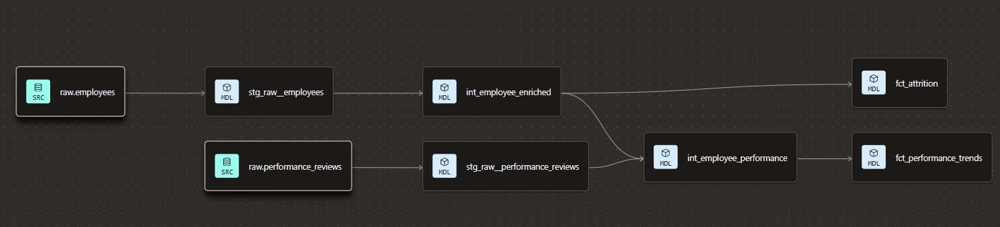

# dbt HR Analytics

A dbt project built on Snowflake modeling IBM HR Analytics data, designed to demonstrate core Analytics Engineering skills: source declaration, staging models, intermediate joins, mart aggregations, tests, and documentation.
> Built as a portfolio project after completing the [dbt Fundamentals](https://courses.getdbt.com/courses/fundamentals) course. 

---

## Data Sources

| Table | Origin | Rows |
|---|---|---|
| `raw.employees` | [IBM HR Analytics Employee Attrition & Performance](https://www.kaggle.com/datasets/pavansubhasht/ibm-hr-employee-attrition) (Kaggle) | 1,470 |
| `raw.performance_reviews` | Synthetic — generated to demonstrate joins. Four review periods per employee (2022-H1 through 2023-H2), anchored to IBM performance ratings. | 5,880 |

---

## Project Structure

```
models/
├── staging/
│   ├── sources.yml
│   ├── schema.yml
│   ├── stg_raw__employees.sql
│   └── stg_raw__performance_reviews.sql
├── intermediate/
│   ├── schema.yml
│   ├── int_employee_enriched.sql
│   └── int_employee_performance.sql
└── marts/
    ├── schema.yml
    ├── fct_attrition.sql
    └── fct_performance_trends.sql
tests/
└── assert_global_attrition_rate_below_50.sql
```

---

## Models

### Staging

| Model | Description |
|---|---|
| `stg_raw__employees` | Cleaned employee data from IBM HR dataset |
| `stg_raw__performance_reviews` | Cleaned performance review records |

### Intermediate

| Model | Description |
|---|---|
| `int_employee_enriched` | Employees with compensation, tenure, and age bands |
| `int_employee_performance` | Join of enriched employees with performance reviews |

### Marts

| Model | Description | 
|---|---|
| `fct_attrition` | Headcount, termed employees, and attrition rate by department, job role, tenure band, compensation band, and age band |
| `fct_performance_trends` | Average performance rating, goal completion, and manager feedback score by review period and employee segments |

---

## Lineage



---

## Tests

| Type | Count | Description |
|---|---|---|
| `unique` | 3 | `employee_id` in staging, `review_id` in staging and source |
| `not_null` | 5 | Key identifiers and critical fields |
| `accepted_values` | 3 | `attrition`, `review_type`, `review_period` |
| `relationships` | 1 | `performance_reviews.employee_id` → `employees.employee_id` |
| Singular | 1 | Global attrition rate must not exceed 50% |

---

## How to Run

This project runs on dbt Cloud connected to Snowflake. To replicate it you'll need a Snowflake account with the `hr_analytics` database and raw tables loaded, and a dbt Cloud project connected to this repo.

Connection settings are not committed to this repo. See `profiles.yml` documentation for reference.

---

## Stack

- **Warehouse:** Snowflake (Free Trial)
- **Transformation:** dbt Cloud (Developer — free tier)
- **Data:** IBM HR Analytics (Kaggle) + synthetic performance reviews
